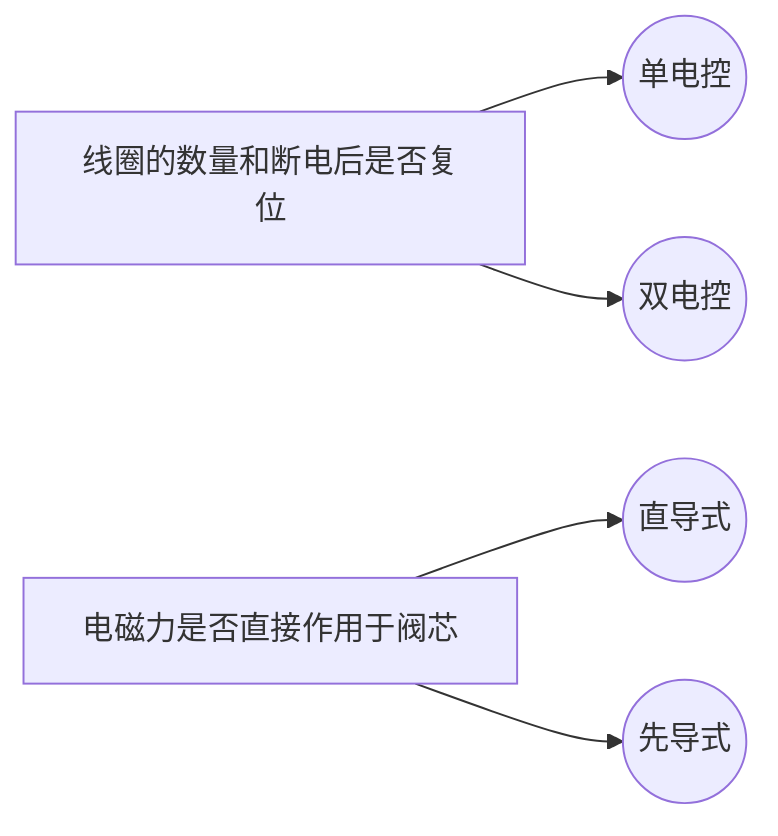
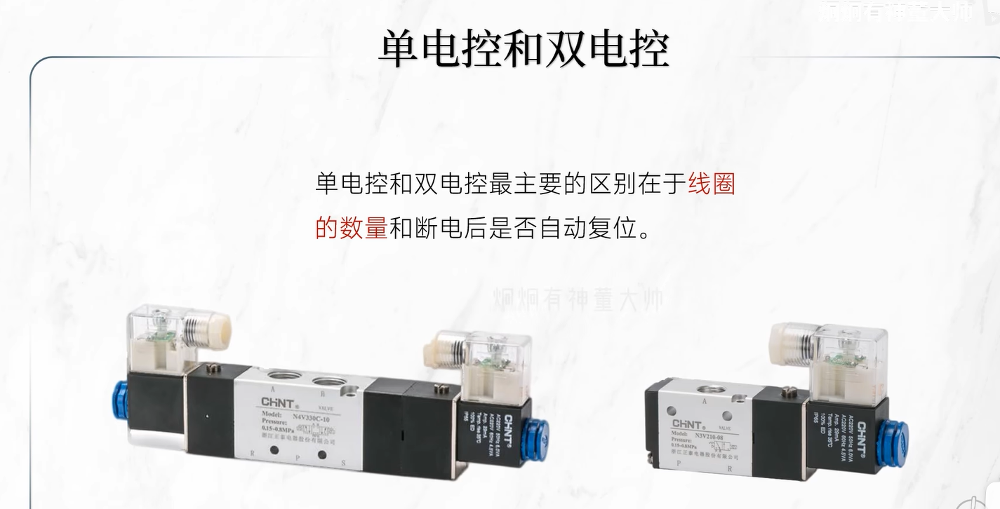
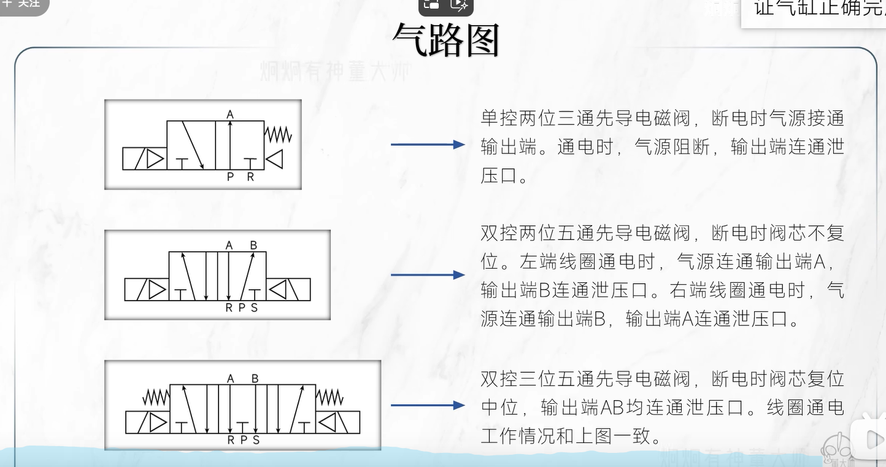

# 1.什么是电磁阀
电磁阀（P1.1）是一种利用电磁原理，使用磁场控制流体系统的阀。常见在气动装置中对气缸的进气和排气进行控制，从而实现气缸的正反转，保证气缸正确完成对装置的操作。
	

# 2.应用场景

									P2.1

# 3.主要结构

														P3.1

​														P3.2

# 4.电磁阀的种类

															P4.1
															P4.2

# 5.工作原理
[电磁阀工作原理](https://www.bilibili.com/video/BV1x8411c7hh/?spm_id_from=333.337.search-card.all.click&vd_source=1cd25fad923240a9a649bebca62a9fea)
# 6.如何看懂气路图

参考网站：
[5分钟了解电磁阀](https://www.bilibili.com/video/BV1Cx4y1P7u9/?spm_id_from=333.337.search-card.all.click&vd_source=1cd25fad923240a9a649bebca62a9fea)
[电磁阀工作原理](https://www.bilibili.com/video/BV1x8411c7hh/?spm_id_from=333.337.search-card.all.click&vd_source=1cd25fad923240a9a649bebca62a9fea)